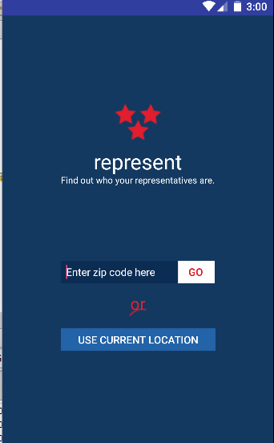
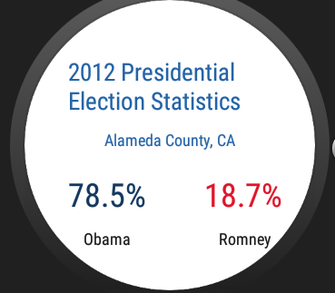

# PROG 02: Represent!

This application takes in a zipcode or the user’s current location and returns the list of congressional representatives for that area.  It is paired with a smartwatch the displays the representatives as well.  When the watch is shaken, a random location is chosen.

## Authors

AnnaMarie Garlin ([agarlin18@berkeley.edu](mailto:agarlin18@berkeley.edu))

## Demo Video

See [your demo video title here] (https://link_to_your_video)

## Screenshots

## Acknowledgments

* Hat tip to anyone who's code was used
* Any other support
